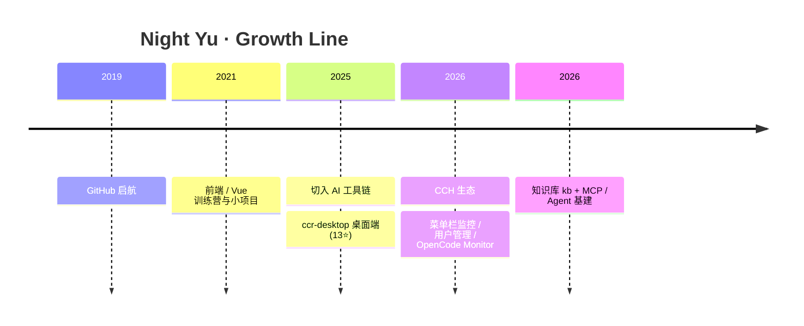

<!-- Profile README · NightYuYyy · tokyonight -->

 

 

---

## About Me

- 🛠️ **AI 工具链工程师** — 围绕 Claude Code / OpenCode / MCP / Agent 打磨日常可用的工程化工具
- 🖥️ 桌面端 + 服务端双线：Electron / Tauri 菜单栏监控，Fastify / Python 管理与知识库
- ⚙️ 目标：让 AI 编程工作流**可观测、可管理、可复用**，而不是一堆零散脚本
- 🌙 账号是 Night，代码也多在夜里写 —— 喜欢把「自己天天用的东西」做成开源产品

---

## Timeline

---

## Impact · Live Badges

> 数字跟着仓库自动涨，不手写。

---

## Featured Projects

<table>
  <tr>
    <td width="50%">
      <a href="https://github.com/NightYuYyy/ccr-desktop">
        <picture>
          <source media="(prefers-color-scheme: dark)" srcset="https://socialify.git.ci/NightYuYyy/ccr-desktop/image?description=1&font=Inter&language=1&name=1&owner=1&pattern=Plus&stargazers=1&theme=Dark" />
          
        </picture>
      </a>
      
<b>ccr-desktop</b> · Electron + Vue3 Claude Code Router 跨平台桌面端 · 可视化配置 / 一键启停 / 实时状态

    </td>
    <td width="50%">
      <a href="https://github.com/NightYuYyy/opencode-go-monitor">
        <picture>
          <source media="(prefers-color-scheme: dark)" srcset="https://socialify.git.ci/NightYuYyy/opencode-go-monitor/image?description=1&font=Inter&language=1&name=1&owner=1&pattern=Plus&stargazers=1&theme=Dark" />
          
        </picture>
      </a>
      
<b>opencode-go-monitor</b> · HTML + Python OpenCode Go 多账号用量实时监控 · API Key 展示 · 自动发现 workspace

    </td>
  </tr>
  <tr>
    <td width="50%">
      <a href="https://github.com/NightYuYyy/Claude-Code-Hub-Bar-Rust">
        <picture>
          <source media="(prefers-color-scheme: dark)" srcset="https://socialify.git.ci/NightYuYyy/Claude-Code-Hub-Bar-Rust/image?description=1&font=Inter&language=1&name=1&owner=1&pattern=Plus&stargazers=1&theme=Dark" />
          
        </picture>
      </a>
      
<b>Claude-Code-Hub-Bar-Rust</b> · Rust + Tauri 跨平台菜单栏监控 · Dashboard / Leaderboard / Logs · Win + macOS

    </td>
    <td width="50%">
      <a href="https://github.com/NightYuYyy/cch-manager">
        <picture>
          <source media="(prefers-color-scheme: dark)" srcset="https://socialify.git.ci/NightYuYyy/cch-manager/image?description=1&font=Inter&language=1&name=1&owner=1&pattern=Plus&stargazers=1&theme=Dark" />
          
        </picture>
      </a>
      
<b>cch-manager</b> · Fastify + TypeScript CCH 用户管理 · 额度查询 / 临时额度 / 暗色 UI

    </td>
  </tr>
  <tr>
    <td colspan="2" align="center">
      <a href="https://github.com/NightYuYyy/kb">
        <picture>
          <source media="(prefers-color-scheme: dark)" srcset="https://socialify.git.ci/NightYuYyy/kb/image?description=1&font=Inter&language=1&name=1&owner=1&pattern=Plus&stargazers=1&theme=Dark" />
          
        </picture>
      </a>
      
<b>kb</b> · Python · CLI + Web UI + REST API 个人知识库 · 向量检索 + AI 问答 · 给 ChatGPT / Claude / Codex 当外挂记忆

    </td>
  </tr>
</table>

<b>📦 产品线一览（展开）</b>

| 产品线 | 代表仓库 | 一句话 |
|--------|----------|--------|
| Claude Code Router 桌面 | [`ccr-desktop`](https://github.com/NightYuYyy/ccr-desktop) | 可视化管理 CCR，跨平台 Electron |
| OpenCode 可观测性 | [`opencode-go-monitor`](https://github.com/NightYuYyy/opencode-go-monitor) | 多账号用量 / 套餐剩余一眼看完 |
| Claude Code Hub 菜单栏 | [`Claude-Code-Hub-Bar-Rust`](https://github.com/NightYuYyy/Claude-Code-Hub-Bar-Rust) | 原 Swift 逻辑的 Rust/Tauri 移植 |
| CCH 运营后台 | [`cch-manager`](https://github.com/NightYuYyy/cch-manager) | 额度、临时额度、定时恢复 |
| 个人知识库 | [`kb`](https://github.com/NightYuYyy/kb) | SQLite + 向量 + AI，CLI/Web/API 三端 |

---

## Skills

 

| 层 | 栈 |
|----|----|
| 语言 | TypeScript · JavaScript · Python · Go · Rust |
| 前端 / 桌面 | Vue · Electron · Tauri · HTML |
| 后端 | Fastify · Node · Python CLI/API · SQLite |
| 工程 | Docker · GitHub Actions · MCP · Agent 工具链 |

---

## Activity

 

<!-- snake: Action 首次跑完 output 分支后才会显示 -->

---

## Connect

 

> *Build tools that make AI coding feel like engineering — not magic.*

